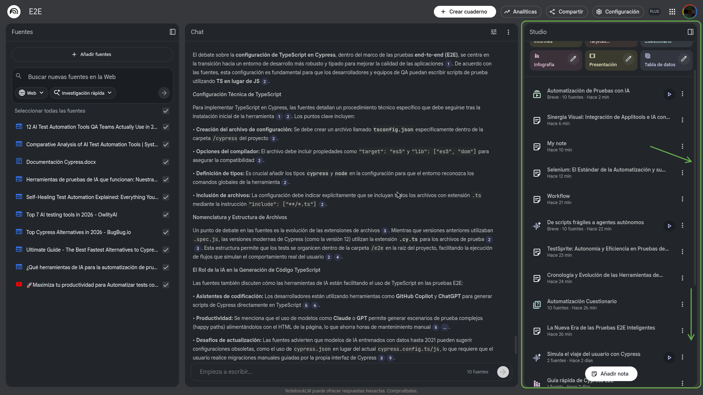
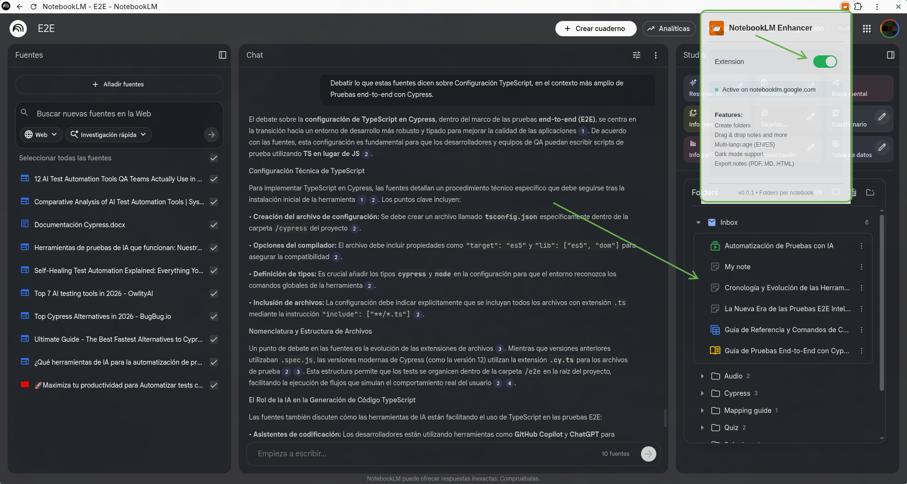
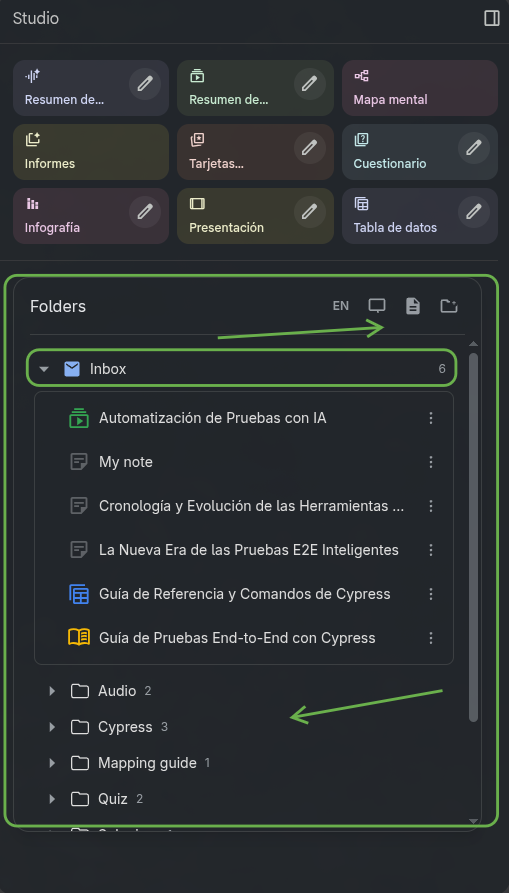
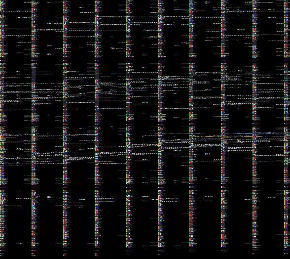
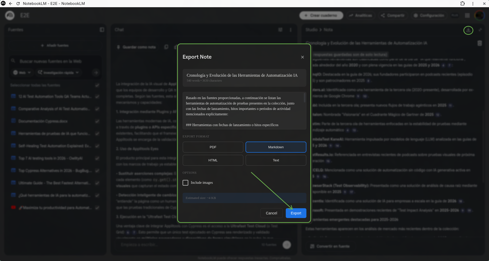

# NotebookLM Enhancer
**GitHub Copilot CLI Challenge**


[](https://developer.chrome.com/docs/extensions/mv3/intro/)
[](https://angular.io/)
[](https://www.typescriptlang.org/)
[](https://tailwindcss.com/)

> Transform NotebookLM's chaotic sidebar into a beautifully organized folder system

 A Chrome extension that adds smart folder management, drag & drop, and themes to NotebookLM because 47 research notes shouldn't look like a pile of digital laundry.

---

## Screenshots

### Before: The Chaos

*20+ notes in a flat, unorganized list*

### After: The Order

### Extension Popup

*Easy toggle to enable/disable the extension*


*Beautifully organized with folders and drag & drop*

### Drag & Drop in Action

*Seamlessly move notes between folders*


### Export system

*Easy to export your notes*

---

## The Problem

If you've used [NotebookLM](https://notebooklm.google.com), you know it's *magical* for research. Upload PDFs, paste URLs, ask questions. It's like having a research assistant that never sleeps.

But there's one maddening catch: **the sidebar becomes a nightmare when you have more than 10 notes.**

Imagine:
- 15 research papers on Spring Framework
- 8 articles about microservices
- 12 random bookmarks you saved "for later"

All in one giant list.

**No folders. No organization. Just chaos.**

---

## The Solution

NotebookLM Enhancer injects a complete folder management system directly into NotebookLM's sidebar. Think of it as "Finder for NotebookLM" but lighter, faster, and built for researchers.

### Key Features

**Smart Folder Organization**
- Create folders and subfolders (1 level deep, keeping it simple!)
- Drag & drop notes between folders with smooth animations
- "Inbox" view for unassigned notes
- Each notebook project has isolated folders (no cross-contamination!)

**Polished UI**
- Built with Angular 19 + Tailwind CSS
- Dark/Light/System theme toggle
- Minimalist design that feels native to NotebookLM
- Smooth expand/collapse animations
- Auto-focus inputs for better UX

**Internationalization**
- Full i18n support (English/Spanish currently)
- One-click language switcher
- All UI text translatable via JSON files

**Intelligent Integrations**
- Click any note to open native NotebookLM
- Click 3-dots menu to see native menu (aligned to match native position)
- Drag notes from native sidebar to drop into organized folders
- Add new notes button that triggers native NotebookLM

**Export System**
- Export notes to PDF, Markdown, HTML, or Plain Text
- Injected button when viewing a note
- Configurable options (images, citations, page numbers)
- Dark mode support in exports

**Batch Delete**
- Select multiple notes at once with checkboxes
- "Selection Mode" toggle in header
- Click any row to toggle selection
- Progress indicator during deletion ("Deleting 2/5...")
- ESC key to cancel selection mode
- Confirmation modal before deleting

**Robust Architecture**
- Chrome Extension MV3 (latest manifest version)
- Content Scripts + Shadow DOM for complete style isolation
- Iframe-based Angular app for the UI
- PostMessage bridge for iframe page communication
- `chrome.storage.sync` for persistence across devices
- Per-notebook folder isolation (Storage V3)

---

## Architecture

This isn't a simple content script that adds a few buttons. It's a full micro-frontend architecture:

```
┌─────────────────────────────────────────────────────────┐
│  NotebookLM Page (notebooklm.google.com)                │
│                                                         │
│  ┌─────────────────────────────────────────────────┐    │
│  │  Studio Panel (section.studio-panel)            │    │
│  │                                                 │    │
│  │  ┌───────────────────────────────────────────┐  │    │
│  │  │  .panel-content-scrollable                │  │    │
│  │  │  ┌─────────────────────────────────────┐  │  │    │
│  │  │  │  #notebooklm-enhancer-root (Host)    │ │  │    │
│  │  │  │  (height: dinámico via ResizeObserver│ │  │    │
│  │  │  │                                      │ │  │    │
│  │  │  │  ┌───────────────────────────────┐  │  │  │    │
│  │  │  │  │  Shadow DOM                   │  │  │  │    │
│  │  │  │  │  ┌─────────────────────────┐  │  │  │  │    │
│  │  │  │  │  │  IFRAME (Angular App)   │  │  │  │  │    │
│  │  │  │  │  │                         │  │  │  │  │    │
│  │  │  │  │  │  • Theme toggle         │  │  │  │  │    │
│  │  │  │  │  │  • Inbox                │  │  │  │  │    │
│  │  │  │  │  │  • Folder tree (1 nivel)│  │  │  │  │    │
│  │  │  │  │  │  • Drag & drop (CDK)    │  │  │  │  │    │
│  │  │  │  │  │  • Modal prompts        │  │  │  │  │    │
│  │  │  │  │  └─────────────────────────┘  │  │  │  │    │
│  │  │  │  └───────────────────────────────│  │  │  │    │
│  │  │  └──────────────────────────────────│  │  │  │
│  │  │                                     │  │     │
│  │  │  .artifact-library-container (NATIVO)│ │     │ ← OCULTO (max-height: 0)
│  │  │    • artifact-library-note           │ │     │   pero sigue en DOM
│  │  │    • artifact-more-button           │  │     │   para menus/acciones
│  │  └─────────────────────────────────────┘  │     │
│  └───────────────────────────────────────────┘     │
└─────────────────────────────────────────────────────────┘
```

**Why an iframe inside Shadow DOM?**
- **Isolation:** NotebookLM uses Angular Material with global styles. Our iframe keeps our Tailwind styles pristine.
- **Security:** Content scripts can't easily access iframe internals (and vice versa).
- **Performance:** Angular app runs independently without polluting the main page.

**Communication Flow:**
1. Content script reads native DOM and extracts notebook data
2. PostMessage to iframe makes Angular display organized folders
3. User drags note to folder and PostMessage goes back to content script
4. Content script updates `chrome.storage.sync`

---

## Installation

### Method : Load Unpacked (Development)

1. **Clone the repository:**
   ```bash
   git clone https://github.com/CGCM070/NotebookLM_Enhancer.git
   cd NotebookLM_Enhancer
   ```

2. **Install dependencies:**
   ```bash
   npm install
   ```

3. **Build the extension:**
   ```bash
   npm run build:ext
   ```
   
   Or for development with auto-rebuild:
   ```bash
   npm run watch:ext
   ```

4. **Load in Chrome:**
   - Open Chrome and navigate to `chrome://extensions/`
   - Enable "Developer mode" (toggle in top right)
   - Click "Load unpacked"
- Select the folder: `dist/extension/browser/`
- The extension icon should appear in your toolbar!

**Windows Users: Build Requirements**

**Prerequisites for Building:**
- **Node.js 64-bit (x64)** is required. Tailwind CSS v4 uses LightningCSS which does not support 32-bit Windows.
- Verify your Node.js architecture: `node -p "process.arch"` should print `x64`

**Common Error:**
If you see `Error: Cannot find module '../lightningcss.win32-ia32-msvc.node'`, you are using 32-bit Node.js. Download the 64-bit version from [nodejs.org](https://nodejs.org/).

**Quick Solution - Use Prebuilt ZIP:**
A ready-to-load extension archive is included: `NotebookLM_Extension.zip`

1. Extract `NotebookLM_Extension.zip` to a folder
2. Open `chrome://extensions/` in Chrome
3. Enable "Developer mode" (toggle top right)
4. Click "Load unpacked" and select the extracted folder
5. The extension loads without building from source

**Alternative Solutions:**
- **Install Node.js 64-bit** - Download x64 version from nodejs.org (recommended)
- **Use WSL2** - Run `npm install` and `npm run build:ext` in Windows Subsystem for Linux
- **Git Bash** - Some users have success using Git Bash for the build process

*Node.js 18+ and npm 9+ recommended for all build methods*

5. **Use it:**
   - Navigate to [notebooklm.google.com](https://notebooklm.google.com)
   - Open any notebook
   - The extension will automatically inject the organized sidebar
   - Click the extension icon in the toolbar to toggle on/off


---

## Development Setup

### Prerequisites

- Node.js 18+ 
- npm 9+
- Chrome browser

### Development Commands

```bash
# Install dependencies
npm install

# Start Angular development server (for UI development)
npm run start
# Navigate to http://localhost:4200

# Build for production
npm run build

# Build extension (for Chrome loading)
npm run build:ext

# Watch mode for extension development (auto-rebuild on changes)
npm run watch:ext

# Lint code
npm run lint

# Format code
npm run format
```

### Project Structure

```
NotebookLM_Enhancer/
├── extension/           # Chrome Extension files
│   ├── content/        # Content Scripts (JS)
│   │   ├── export/     # Export system modules
│   │   ├── main.js     # Entry point
│   │   └── nle-*.js    # Core modules
│   ├── lib/            # Third-party libraries (pdfmake, etc.)
│   ├── popup/          # Extension popup UI
│   ├── assets/         # Images and assets
│   └── manifest.json   # Extension manifest (MV3)
├── src/                # Angular Application
│   ├── app/
│   │   ├── components/ # UI Components
│   │   ├── services/   # Business Logic
│   │   ├── models/     # TypeScript Models
│   │   └── i18n/       # Translations (EN/ES)
│   └── styles.css      # Global styles
├── dist/                      # Build output
├── NotebookLM_Extension.zip   # Prebuilt extension (no build required)
└── package.json               # Dependencies and scripts
```

---

## Tech Stack

- **Framework:** Angular 19+ (Standalone Components)
- **Styling:** Tailwind CSS 3.0 with custom dark mode
- **Language:** TypeScript 5.0
- **Extension:** Chrome Manifest V3
- **State Management:** RxJS BehaviorSubjects
- **Storage:** chrome.storage.sync (with localStorage fallback)
- **Drag & Drop:** Angular CDK + Native HTML5 Drag API
- **i18n:** Custom lightweight TranslationService
- **PDF Export:** pdfmake + html-to-pdfmake
- **Testing:** Karma + Jasmine
- **Linting:** ESLint + Prettier

---

## How It Works

### Storage & State

Each notebook project has isolated storage:

```typescript
// StorageStateV3
{
  byNotebook: {
    "uuid-abc-123": {
      folders: [...],
      notebookFolderByKey: {...}
    },
    "uuid-def-456": {
      folders: [...],
      notebookFolderByKey: {...}
    }
  }
}
```

This ensures your "Work" folders don't mix with "Personal" research.

### Key Technical Decisions

1. **Iframe + Shadow DOM:** Complete style isolation from NotebookLM's Angular Material
2. **MV3 Service Worker:** Latest Chrome extension format with proper sleep handling
3. **PostMessage Bridge:** Secure bidirectional communication between content script and Angular app
4. **Per-Notebook Isolation:** Clean separation of folder structures per project
5. **Native Menu Reuse:** Leverages NotebookLM's existing menus instead of recreating

---

## Notes

- The extension only activates on `notebooklm.google.com/*` pages
- All data is stored locally in your browser (chrome.storage.sync)
- No data is sent to any external servers
- The native NotebookLM sidebar is hidden but still functional (needed for drag & drop and menus)

---

**Built with love using GitHub Copilot CLI assistance**
